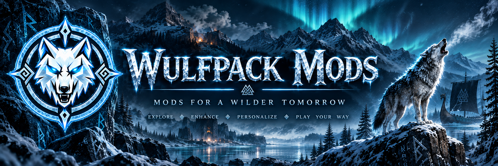

# WulfPack Mods

A maintained monorepo for focused Valheim mods developed under the WulfPack name.

WulfPack Mods is the in-game modding side of the broader WulfPack Valheim project family. It is intentionally separate from [WulfPack Forge](https://github.com/Knapp-Kevin/WulfPackForge), the external character-editor companion application, while keeping the two projects easy to discover from one another.

## Table of contents

- [Current mods](#current-mods)
  - [Rested Whispers](#rested-whispers)
  - [Rune Compass](#rune-compass)
  - [Pied Piper](#pied-piper)
- [Repository structure](#repository-structure)
- [Project family](#project-family)
- [Design principles](#design-principles)
- [Local build and validation policy](#local-build-and-validation-policy)
- [Adding another mod](#adding-another-mod)
- [Status](#status)

## Current mods

| Mod | Purpose | Status | Documentation |
| --- | --- | --- | --- |
| **Rested Whispers** | Gentle, native Valheim warnings as the Rested effect fades. | ✅ Implemented, tested, validated | [README](RestedWhispers/README.md) |
| **Rune Compass** | Immersive No Map navigation with heading and live wind direction. | 🧪 First playable implementation merged; local gameplay validation remains | [README](RuneCompass/README.md) · [Implementation plan](RuneCompass/IMPLEMENTATION_PLAN.md) · [Status](RuneCompass/STATUS.md) |
| **Pied Piper** | One consistent Follow / Stay command for eligible tamed creatures. | 🧱 Repository mesh established; API discovery next | [README](PiedPiper/README.md) · [Implementation plan](PiedPiper/IMPLEMENTATION_PLAN.md) · [Status](PiedPiper/STATUS.md) |

### Rested Whispers

A lightweight client-side quality-of-life mod that watches the existing Rested effect and gives timely native Valheim notifications before it expires.

Key characteristics:

- configurable first and final warnings
- no duplicate expiry message because Valheim already announces expiry
- native Valheim messaging
- client-side only
- BepInEx 5
- no save or world-state mutation
- local install / disable / enable / status / uninstall workflow
- independently removable before joining servers that prohibit third-party mods

Rested Whispers has been built, tested, validated in-game, and accepted as the first completed WulfPack mod proof of capability.

→ [Rested Whispers documentation](RestedWhispers/README.md)

### Rune Compass

Rune Compass is the second resident mod and the next step up in implementation complexity. It is designed for immersive No Map play without turning navigation into a minimap, GPS overlay, or hidden-information system.

Current implementation includes:

- cardinal orientation and player/camera heading
- live wind direction as a visually distinct secondary signal
- wind represented as the direction it is blowing **toward**
- No Map-aware visibility by default, with config override
- configurable enable state, position, scale, opacity, and heading calibration
- primitive custom HUD used as the technical proof before final skin binding
- local install / disable / enable / status / uninstall tooling
- no save or world-state mutation
- no server authority in the current slice

Rune Compass follows one rule: **direction, not hidden information.** It does not currently include map pins, route guidance, home bearing, trader or boss tracking, player tracking, Vegvisir integration, or hidden-location discovery.

The final visual system is designed around interchangeable presentation-only skins. Planned initial families are **Classic Wood**, **Rune Ring**, and **Minimal Nordic**. Skin assets change appearance only, never navigation semantics or gameplay behavior.

→ [Rune Compass documentation](RuneCompass/README.md)  
→ [Implementation plan](RuneCompass/IMPLEMENTATION_PLAN.md)  
→ [Current status](RuneCompass/STATUS.md)

### Pied Piper

Pied Piper is the third resident mod. Its entire job is to make eligible tamed creatures obey one consistent **Follow / Stay** command without turning into a general pet-management framework.

Initial target creature families:

- wolf
- boar
- hen / chicken
- lox
- asksvin

The implementation will prefer Valheim's native tame/follow machinery and preserve vanilla wolf behavior where practical. Rideable tameables such as lox and asksvin must not be forced into Follow while saddle/riding behavior owns movement.

Pied Piper deliberately excludes teleporting pets, formations, mass-radius commands, breeding automation, pet inventory, stat changes, custom pathfinding, and other tame-overhaul features from v0.1.

The repository mesh is established before gameplay code begins so API discovery, implementation, validation, and future creature compatibility have an explicit home.

→ [Pied Piper documentation](PiedPiper/README.md)  
→ [Implementation plan](PiedPiper/IMPLEMENTATION_PLAN.md)  
→ [Current status](PiedPiper/STATUS.md)  
→ [Implementation tracker #6](https://github.com/Knapp-Kevin/WulfPack-mods/issues/6)

## Repository structure

Each mod lives in its own top-level folder and remains independently buildable, packageable, testable, and removable.

```text
WulfPack-mods/
├── banner.png
├── README.md
├── RestedWhispers/
│   ├── Plugin.cs
│   ├── RestedWhispers.csproj
│   ├── build-local.ps1
│   ├── manifest.json
│   ├── icon.png
│   └── README.md
├── RuneCompass/
│   ├── Plugin.cs
│   ├── CompassController.cs
│   ├── CompassUI.cs
│   ├── HeadingProvider.cs
│   ├── WindProvider.cs
│   ├── RuneCompass.csproj
│   ├── build-local.ps1
│   ├── manifest.json
│   ├── icon.png
│   ├── README.md
│   ├── IMPLEMENTATION_PLAN.md
│   ├── STATUS.md
│   └── Assets/
│       └── Skins/
└── PiedPiper/
    ├── README.md
    ├── IMPLEMENTATION_PLAN.md
    ├── STATUS.md
    └── manifest.json
```

Shared tooling should be introduced only when it clearly reduces duplication without coupling otherwise independent mods.

## Project family

WulfPack Mods and WulfPack Forge are related Valheim projects, but they occupy different technical boundaries.

| Project | Type | Role |
| --- | --- | --- |
| **WulfPack Mods** | In-game BepInEx mods | Extend or enhance Valheim while the game is running. |
| **[WulfPack Forge](https://github.com/Knapp-Kevin/WulfPackForge)** | External companion application | Character editing and management outside the running game. |

That boundary is deliberate. Features that belong outside the game should not be forced into a mod merely for branding consistency, and runtime gameplay features should not be shoehorned into Forge. They can still reference one another because they serve the same Valheim audience.

## Design principles

- Prefer small, well-bounded mods over sprawling feature bundles.
- Solve a real gameplay problem instead of cloning an existing popular mod without a reason.
- Avoid save mutation unless the feature genuinely requires it.
- Treat multiplayer synchronization, server authority, and world persistence as explicit complexity boundaries.
- Prefer native Valheim UI and behavior where practical.
- Keep every mod independently removable without damaging a vanilla character or world whenever possible.
- Keep presentation systems separate from gameplay logic. Rune Compass skins are the first explicit example.
- Prefer native game behavior over replacement systems. Pied Piper should adapt Valheim's tame/follow machinery rather than invent custom pathfinding unless proven necessary.
- Treat installed Valheim assemblies as authoritative. Historical mod source is reference material, not a contract.
- Document verified behavior separately from implementation assumptions.

## Local build and validation policy

**GitHub Actions are prohibited in this repository. The GitHub Actions budget is zero.**

Do not add `.github/workflows`, hosted CI jobs, scheduled Actions, release Actions, or Actions-based validation.

Builds, tests, packaging, install-state checks, and in-game validation are performed locally unless an explicitly approved non-Actions mechanism is introduced later.

Each implemented mod owns its local workflow. In general:

```powershell
.\<ModName>\build-local.ps1
.\<ModName>\build-local.ps1 -Install
.\<ModName>\build-local.ps1 -Status
.\<ModName>\build-local.ps1 -Disable
.\<ModName>\build-local.ps1 -Enable
.\<ModName>\build-local.ps1 -Uninstall
```

The scripts are expected to manage only their own files and leave unrelated BepInEx plugins untouched.

## Adding another mod

A new mod should begin as a separate top-level directory with its own:

- source and project file once implementation begins
- README
- implementation/status documentation while the design is still moving
- Thunderstore manifest and icon when appropriate
- local build/install/remove workflow before playable validation
- explicit scope and non-goals
- validation evidence

Add the new mod to the table in [Current mods](#current-mods), then keep its detailed documentation inside the mod directory rather than allowing the root README to become an archaeological dig.

## Status

- **Rested Whispers:** ✅ implemented, tested, validated, and accepted.
- **Rune Compass:** 🧪 first playable implementation is in the repository; local compile and in-game validation remain tracked in issue #4.
- **Pied Piper:** 🧱 repository mesh is established; authoritative Valheim tame/follow API discovery is the next gate in issue #6.
- **GitHub Actions:** prohibited. Zero runs expected.
